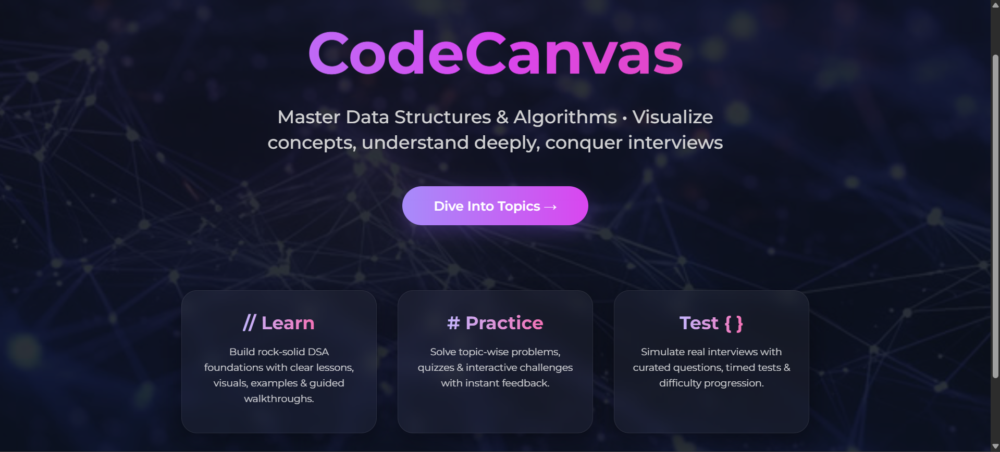
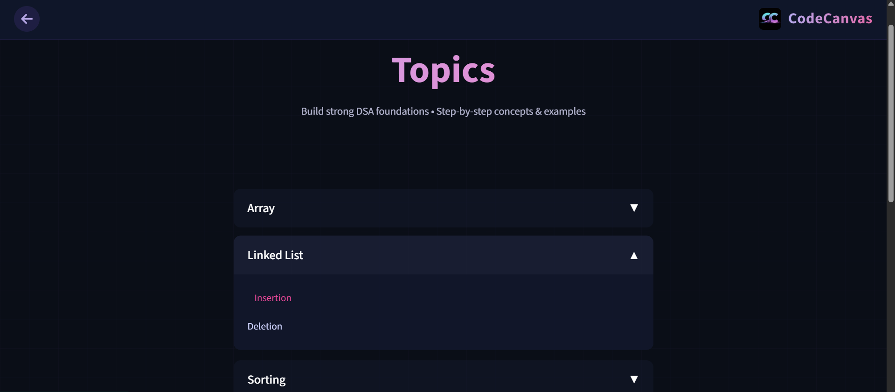
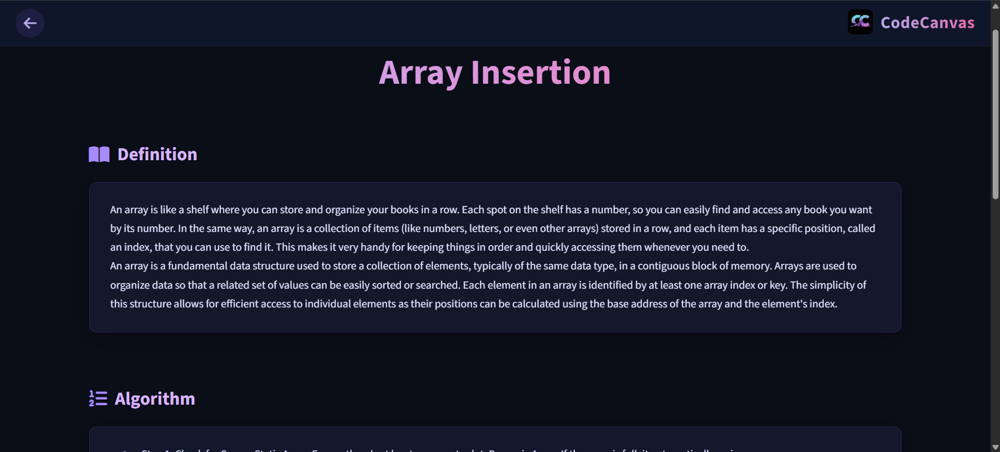
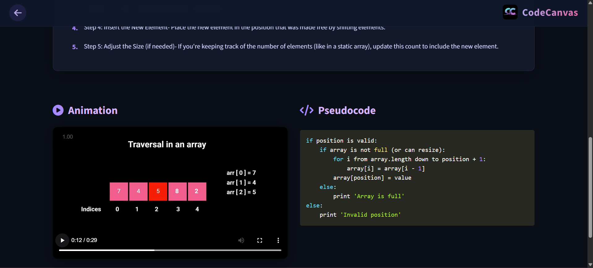
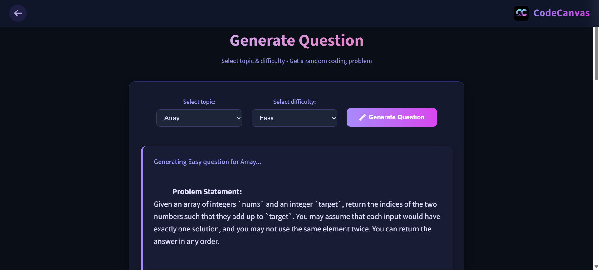

# CodeCanvas

**CodeCanvas** is a modern, interactive platform to learn and master **Data Structures & Algorithms (DSA)** through beautiful visualizations, step-by-step explanations, practice problems, and custom question generation.

Built with love for students, self-learners, and interview prep enthusiasts.

## 🎥 Demo Video

Watch a quick demo of CodeCanvas in action (visualizations, question generation, navigation):

<iframe width="100%" height="500" src="https://youtu.be/dEkRR4Q1cLM" title="CodeCanvas Demo" frameborder="0" allow="accelerometer; autoplay; clipboard-write; encrypted-media; gyroscope; picture-in-picture" allowfullscreen></iframe>

## ✨ Features

- 🎨 **Beautiful visualizations** — Watch algorithms come to life with smooth animations (BFS, DFS, Dijkstra, Sorting, etc.)
- 📚 **Step-by-step concept learning** — Clear explanations + pseudocode + animation
- 🧠 **Practice MCQs & coding problems** — Topic-wise quizzes and challenges
- ⚡ **Generate custom questions** — Choose topic & difficulty → get random problems instantly
- 💻 **Responsive & dark theme** — Clean UI built for long study sessions
- 🐳 **Docker ready** — Easy to run locally or deploy anywhere

## 🛠 Tech Stack

| Category            | Technology/Tools                                 |
|---------------------|--------------------------------------------------|
| Frontend            | CSS, JavaScript, EJS (Embedded JavaScript)       |
| Backend             | Node.js + Express.js                             |
| Animations          | Motion Canvas                                    |
| Environment         | dotenv for API keys                              |
| Containerization    | Docker (Dockerfile + .dockerignore)              |
| Version Control     | Git + GitHub                                     |
| Deployment          | AWS EC2                                          |

## 📸 Screenshots

### Home Page


### Topic Selection Grid


### Learn Page 





### Quiz Page


### Coding Question Page


## 🚀 How to Run Locally (without Docker)

### Prerequisites

- Node.js ≥ 18
- npm or yarn
- Git

### Steps

1. Clone the repo

```bash
git clone https://github.com/yourusername/codecanvas.git
cd codecanvas
```

2. Install dependencies

```bash
npm install
```

3. Create `.env` file in root

```env
GEMINI_API_KEY=your_gemini_api_key_here
PORT=8080
```

4. Start the server

```bash
node index.js
# or (if you added it to package.json)
npm start
```

5. Open in browser

```
http://localhost:8080
```

## 🐳 Run with Docker 

1. Build the image

```bash
docker build -t codecanvas-app .
```

2. Run the container

```bash
docker run -p 8080:8080 --env-file .env codecanvas-app
```

3. Open → http://localhost:8080

